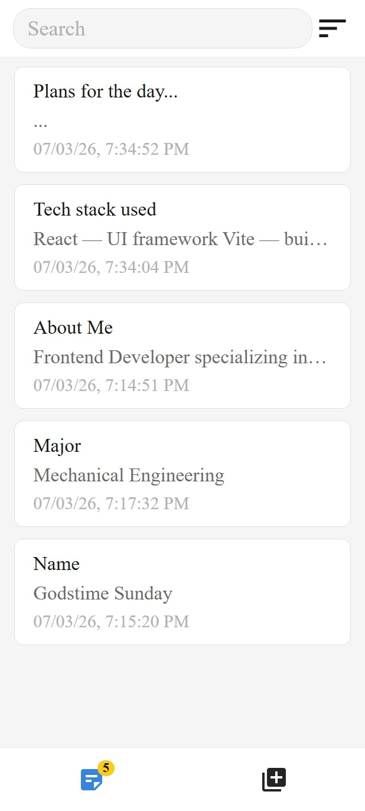
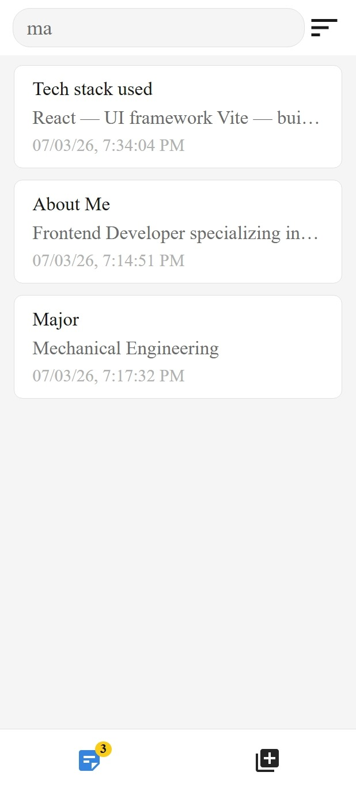
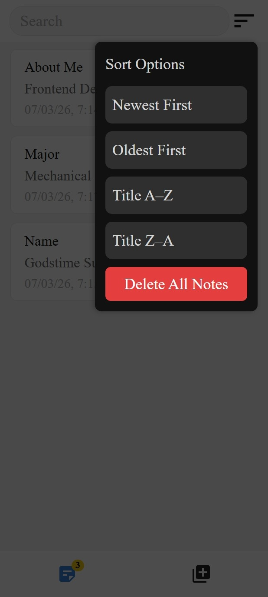
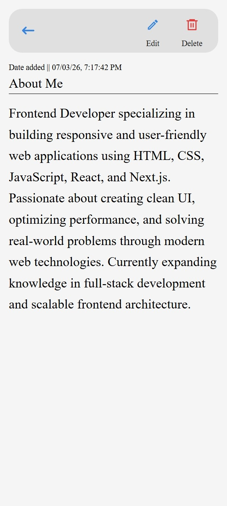
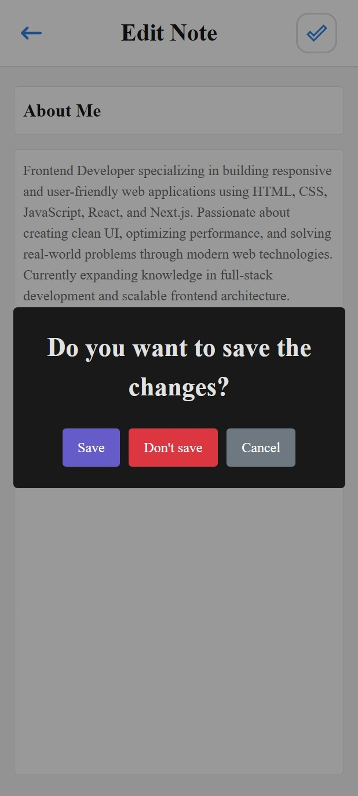

# 📝 Notepad

A clean, minimal notepad app built with React. Create, edit, delete, and sort your notes — all stored locally in your browser.

live site: https://notepad-v1.vercel.app/

---

## ✨ Features

- **Create notes** with a title and body
- **Edit & delete** individual notes
- **Search** through notes in real time
- **Sort** notes by newest, oldest, or title (A–Z / Z–A)
- **Delete all notes** at once
- **Persistent storage** via localStorage — notes survive page refreshes
- Responsive, mobile-friendly layout

---

## 📸 Screenshots

<table>
  <tr>
    <td></td>
    <td></td>
  </tr>
  <tr>
    <td></td>
    <td></td>
  </tr>
  <tr>
    <td></td>
    <td></td>
  </tr>
</table>

---

## 🛠️ Tech Stack

- [React](https://react.dev/) — UI framework
- [Vite](https://vitejs.dev/) — build tool
- [React Router](https://reactrouter.com/) — client-side routing
- [shadcn/ui](https://ui.shadcn.com/) — UI components
- [Sonner](https://sonner.emilkowal.ski/) — toast notifications
- [SweetAlert2](https://sweetalert2.github.io/) — confirmation dialogs
- [date-fns](https://date-fns.org/) — date formatting
- [Lucide React](https://lucide.dev/) — icons

---

## 🚀 Getting Started

### Prerequisites

- Node.js v18+
- npm

### Installation

```bash
# Clone the repository
git clone https://github.com/Gt1code/notepad.git

# Navigate into the project
cd notepad

# Install dependencies
npm install

# Start the development server
npm run dev
```

Then open [http://localhost:5173](http://localhost:5173) in your browser.

---

## 📁 Project Structure

```
src/
├── components/        # Reusable UI components
│   ├── Footer.jsx
│   ├── Header.jsx
│   ├── MobileMenu.jsx
│   └── NoteItem.jsx
├── contexts/
│   ├── NotesContext.js
│   └── NotesProvider.jsx
├── hooks/
├── pages/
│   ├── AddNotePage.jsx
│   ├── EachNote.jsx
│   ├── EditNotePage.jsx
│   └── ErrorPage.jsx
├── utilities/
│   └── Alert.js
├── App.jsx
└── main.jsx
```

---

## 💾 Data Storage

Notes are stored in the browser's `localStorage` under the key `"notes"` as a JSON array. Each note has the following shape:

```json
{
  "id": "uuid",
  "title": "Note title",
  "body": "Note body content",
  "datetime": "2025-04-12T09:00:00.000Z",
  "displayDate": "12/04/25, 9:00 AM"
}
```

> ⚠️ Notes are stored per browser. Clearing your browser data will erase all notes.

---

## 🔮 Planned Features

- [ ] User authentication
- [ ] Cloud sync via API
- [ ] Dark/light theme toggle
- [ ] Note categories / tags
- [ ] Rich text editing

---

## 📄 License

[MIT](./LICENSE)
