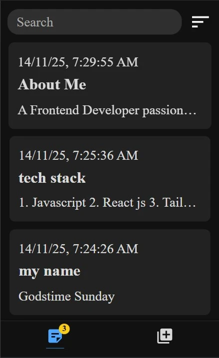
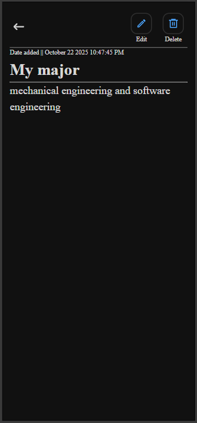
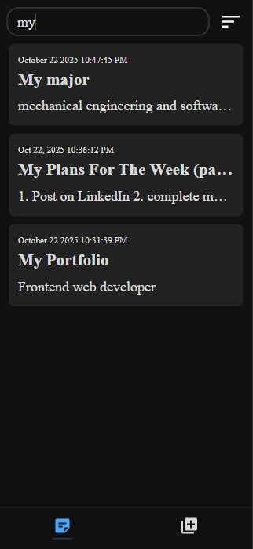

# Notepad Web App

A simple and responsive notepad web app built with **React**, **Node.js**, and **HTML/CSS**.

## Screenshots

## Features

- Add, edit, and delete notes
- Clean and mobile-friendly design

## Tech Stack

- **React** for frontend
- **Node.js** for dependency management (via npm)
- **HTML/CSS** for structure and styling

## Live Demo

https://notepad-v1.onrender.com
